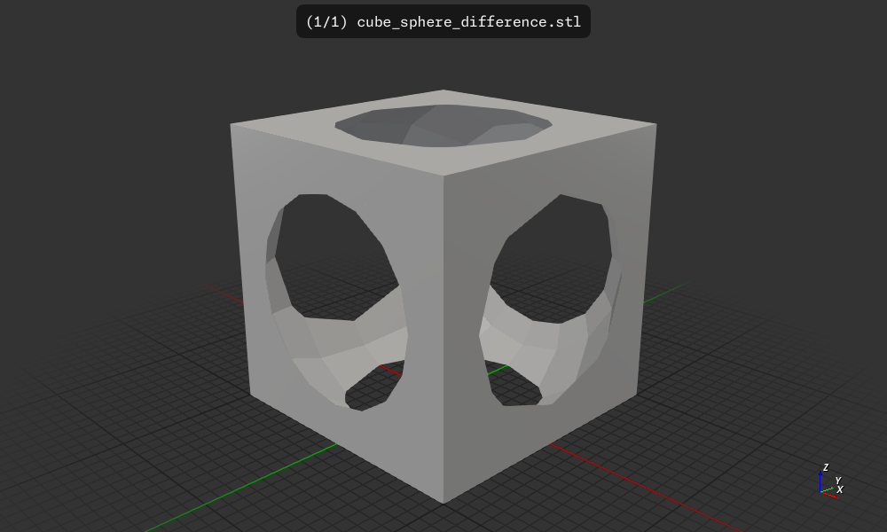

# csgrs-simple

A simple example of a Rust project using the `csgrs` crate.

## Usage

```
wink@3900x 25-08-04T18:56:53.372Z:~/data/3D-Graphics-CAD-CAM/csgrs/csgrs-simple (main)
$ cargo run
    Finished `dev` profile [unoptimized + debuginfo] target(s) in 0.07s
     Running `target/debug/csgrs-simple`
wink@3900x 25-08-04T18:57:40.981Z:~/data/3D-Graphics-CAD-CAM/csgrs/csgrs-simple (main)
$ f3d cube_sphere_difference.stl --output cube_sphere_difference.png
wink@3900x 25-08-04T18:57:59.990Z:~/data/3D-Graphics-CAD-CAM/csgrs/csgrs-simple (main)
```

results `cube_sphere_differnce.stl` and `cube_sphere_difference.png`:



## License

Licensed under either of

- Apache License, Version 2.0 ([LICENSE-APACHE](LICENSE-APACHE) or http://apache.org/licenses/LICENSE-2.0)
- MIT license ([LICENSE-MIT](LICENSE-MIT) or http://opensource.org/licenses/MIT)

### Contribution

Unless you explicitly state otherwise, any contribution intentionally submitted
for inclusion in the work by you, as defined in the Apache-2.0 license, shall
be dual licensed as above, without any additional terms or conditions.
